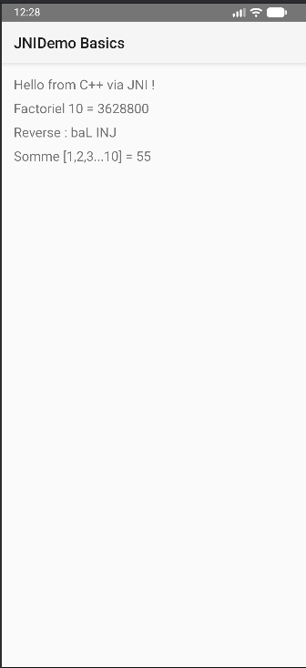
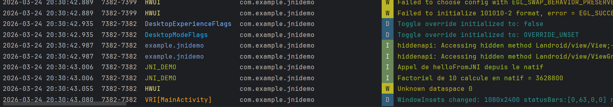
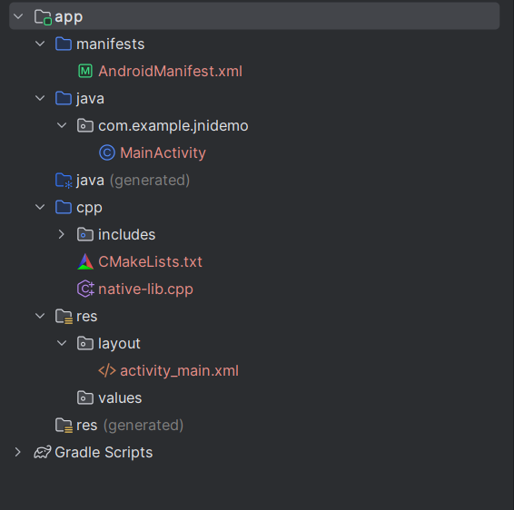

# Laboratoire JNI : Fondamentaux du Développement Natif Android

## Objectifs Pédagogiques
Ce laboratoire permet d'apprendre à intégrer du code natif **C++** dans une application **Android** via **JNI** (Java Native Interface). Les points clés abordés sont :
* Configuration de **CMake** dans Android Studio.
* Passage de paramètres simples (entiers) et complexes (chaînes de caractères, tableaux).
* Utilisation de la bibliothèque de **log native** (`__android_log_print`).
* Manipulation de la mémoire JNI (Get/Release).

---

## 1. Architecture du Projet
Le projet est structuré autour d'une interface Java (`MainActivity.java`) qui communique avec une bibliothèque partagée (`libnative-lib.so`) compilée à partir de `native-lib.cpp`.

### Structure des fichiers clés :
* `app/src/main/cpp/native-lib.cpp` : Implémentation des fonctions en C++.
* `app/src/main/cpp/CMakeLists.txt` : Script de configuration pour la compilation.
* `MainActivity.java` : Déclaration des méthodes `native` et interface utilisateur.

---

## 2. Implémentations Natives (C++)

Nous avons implémenté quatre fonctionnalités majeures en natif :

1. **Hello World JNI** : Retourne une chaîne simple.
2. **Calcul de Factoriel** : Calcul itératif avec vérification d'overflow.
3. **Inversion de Chaîne** : Utilise `std::reverse` après conversion JNI.
4. **Somme de Tableau** : Parcourt un `jintArray` pour calculer la somme des éléments.

---

## 3. Captures d'Écran et Validation

### Résultat de l'Application
L'interface affiche les retours synchrones des appels JNI :

### Logs Natifs (Logcat)
On peut observer dans Logcat (filtre `JNI_DEMO`) les traces générées directement par le C++ :

### Structure du Projet
Preuve de la bonne organisation du module natif :

---

## 4. Conclusion
Ce TP démontre la puissance du NDK pour déporter des traitements logiques ou mathématiques vers une couche native performante tout en conservant une interface utilisateur Java fluide.

---
**Étudiant :** Mahmoud
**Dépôt :** [dev_mobile_lab22](https://github.com/LaasriMahmoud/dev_mobile_lab22.git)
