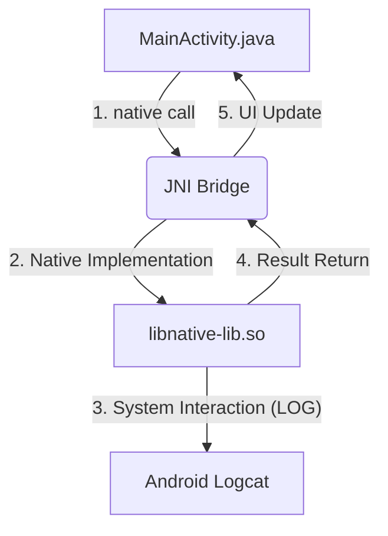

# 🚀 JNI Mastery: Foundational Native Development

<p align="center">
  
  
  
  
</p>

## 📝 Rapport de Laboratoire - JNI Foundations
Ce projet explore l'intégration bas-niveau sous Android. L'objectif est de maîtriser la communication bidirectionnelle entre le **Bytecode Java** et le **Code Machine Natif** via l'interface **JNI** (Java Native Interface).

---

## 🏗️ Architecture du Système

Le diagramme suivant illustre le flux de données entre les couches de l'application :



---

## 🛠️ Fonctionnalités Implémentées

| Fonctionnalité | Signature Native | Description |
| :--- | :--- | :--- |
| **Hello JNI** | `helloFromJNI()` | Initialisation et test de connectivité. |
| **Factoriel** | `factorial(int n)` | Algorithme itératif avec gestion des types `long long` et détection d'overflow. |
| **Inverse String** | `reverseString(String s)` | Manipulation de pointeurs JNI et utilisation de `std::reverse`. |
| **Somme Tableau** | `sumArray(int[] arr)` | Accès direct aux régions mémoire des tableaux Java. |

---

## 🔍 Analyse du Code Critique

### 1. Gestion des Chaînes (Memory Safety)
Pour transformer une `String` Java en `const char*` C++, nous utilisons `GetStringUTFChars`. **Important** : Il faut impérativement libérer cette mémoire avec `ReleaseStringUTFChars` pour éviter les fuites mémoire dans le tas natif.

```cpp
const char* chars = env->GetStringUTFChars(javaString, nullptr);
std::string s(chars);
env->ReleaseStringUTFChars(javaString, chars); // Libération critique
```

### 2. Manipulation de Tableaux
L'accès aux éléments d'un tableau (`jintArray`) se fait via `GetIntArrayElements`, permettant un parcours mémoire ultra-performant.

---

## 🧬 Immersion Technique : Comprendre JNI

### 1. Le rôle du `JNIEnv* env`
Le paramètre `JNIEnv` est un pointeur vers une table de fonctions. C'est l'interface principale pour :
* **Instance de classe** : Créer de nouveaux objets Java.
* **Accès aux champs** : Lire ou modifier des variables Java.
* **Appel de méthodes** : Exécuter du code Java depuis le C++.

> [!CAUTION]
> Le `JNIEnv` est spécifique à un thread. On ne doit jamais le partager entre plusieurs threads natifs.

### 2. Mapping des Types (Sûreté du Typage)
Le tableau suivant montre la correspondance rigoureuse entre les deux mondes :

| Java | JNI (C++) | Description |
| :--- | :--- | :--- |
| `int` | `jint` | Entier 32 bits signé. |
| `String` | `jstring` | Référence vers un objet String (Opaque). |
| `int[]` | `jintArray` | Référence vers un tableau d'entiers. |
| `boolean` | `jboolean` | Valeur logique (JNI_TRUE / JNI_FALSE). |

### 3. Gestion de la Mémoire et "Pinning"
Lorsque l'on manipule des tableaux avec `GetIntArrayElements`, JNI peut soit copier le tableau, soit "épingler" (pin) la mémoire pour empêcher le **Garbage Collector** de déplacer les données pendant que le C++ travaille dessus. 

Le troisième paramètre de `ReleaseIntArrayElements` (ici `0`) indique que l'on veut copier les modifications vers Java et libérer la mémoire temporaire.

---

## 🏗️ Détails des Implémentations

### Inversion de Chaîne (`reverseString`)
L'utilisation de `std::string s(chars)` crée une copie de la chaîne Java dans la mémoire C++. Cela permet d'utiliser les algorithmes de la STL (`std::reverse`). 

### Calcul Factoriel (`factorial`)
Le passage de `jint` (32 bits) vers `long long` (64 bits) interne est essentiel pour éviter les débordements (overflow) intermédiaires avant de vérifier si le résultat final peut encore tenir dans un entier Java.

---

## ⚙️ Pipeline de Compilation (CMake & NDK)
Le fichier `CMakeLists.txt` définit la stratégie de build :
1. `add_library` : Compile le C++ en format ELF (`.so`).
2. `target_link_libraries` : Lie notre code à la bibliothèque système `liblog.so` pour permettre l'affichage des logs dans Android Studio.

---

## 📸 Preuves de Fonctionnement (Proof of Work)

### ✅ Interface Utilisateur
L'application exécute les calculs en temps réel et affiche les résultats retournés par la bibliothèque `.so`.


### 📊 Flux de Sortie (Logcat)
Traces d'exécution capturées directement depuis la couche native :


### 📁 Structure Interne
Organisation modulaire respectant les standards NDK/CMake.


---

## 🚀 Comment Compiler et Déployer
1. **Prérequis** : Android Studio Flamingo+, NDK (Side-by-side), CMake.
2. **Import** : Importer le dossier en sélectionnant `build.gradle`.
3. **Synchronisation** : Attendre la fin du Gradle Sync.
4. **Execution** : `Shift + F10` pour lancer sur émulateur ou appareil physique.

---

> [!TIP]
> **Optimisation** : Contrairement au Java, le code natif peut être optimisé par le compilateur LLVM avec des flags comme `-O3` dans CMake pour des calculs intensifs.

---
**Développeur :** Mahmoud

**Date :** 2026-03-24
